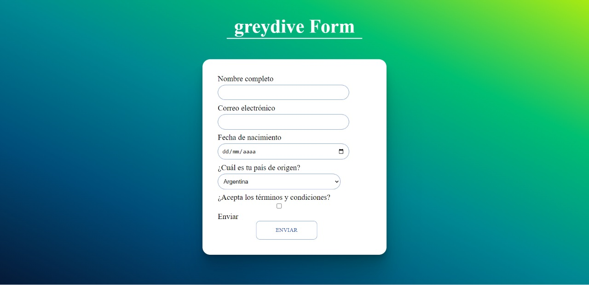
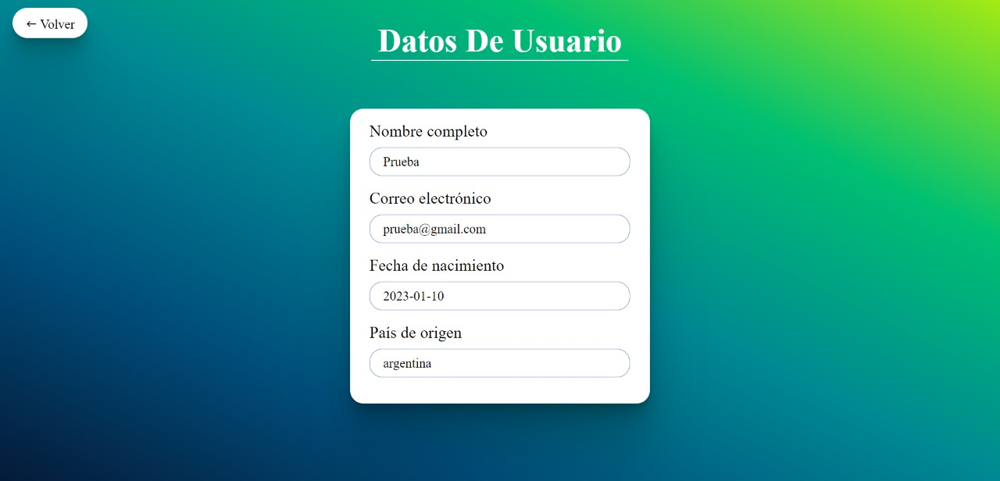

# Challenge form

App de prueba que contiene un formulario controlado creado a partir de la lectura de un archivo .json. Al hacer submit se envian los 
dato del formulario a una base de datos `Firebase` y
se habilita un boton para poder revisar los datos enviados

## Como Usar

El proyecto se encuentra deployado [Ir A Deploy](https://greydiveform.netlify.app) 
pero si desea abrirlo en local solo hace falta:\
`--Clonar Repo`\
`--npm i`\
`--npm start`

## Imagenes

